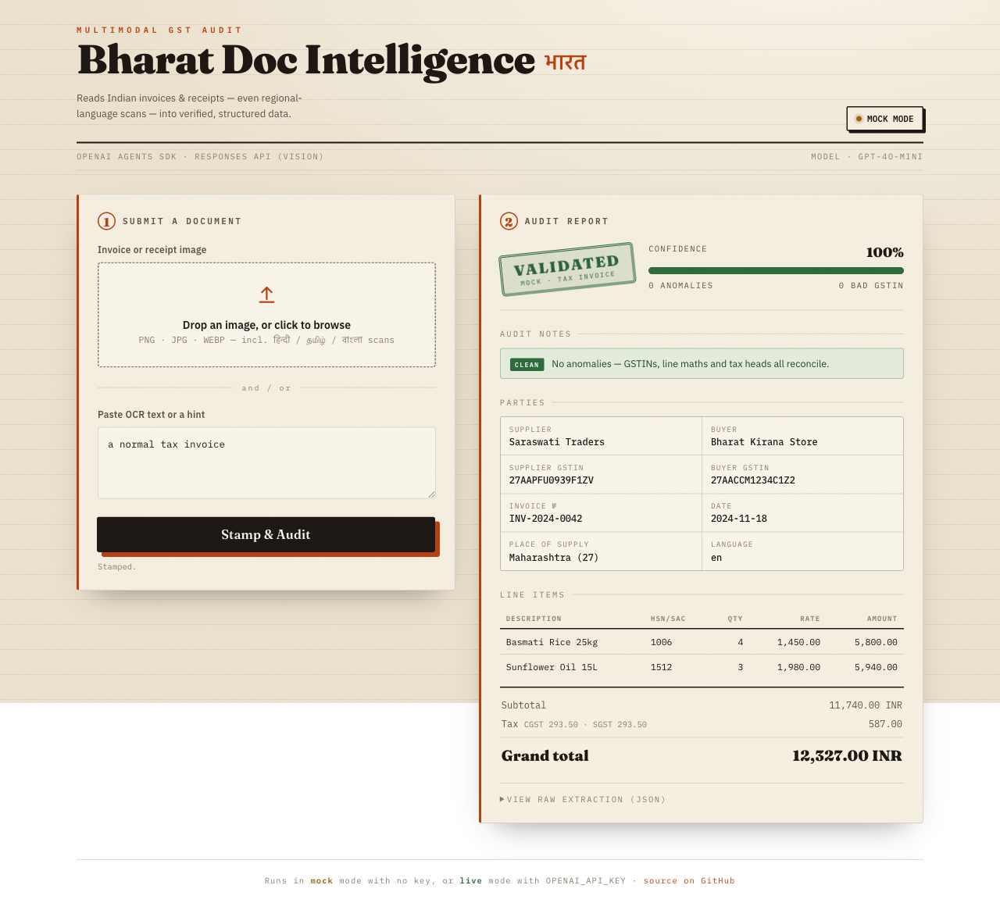
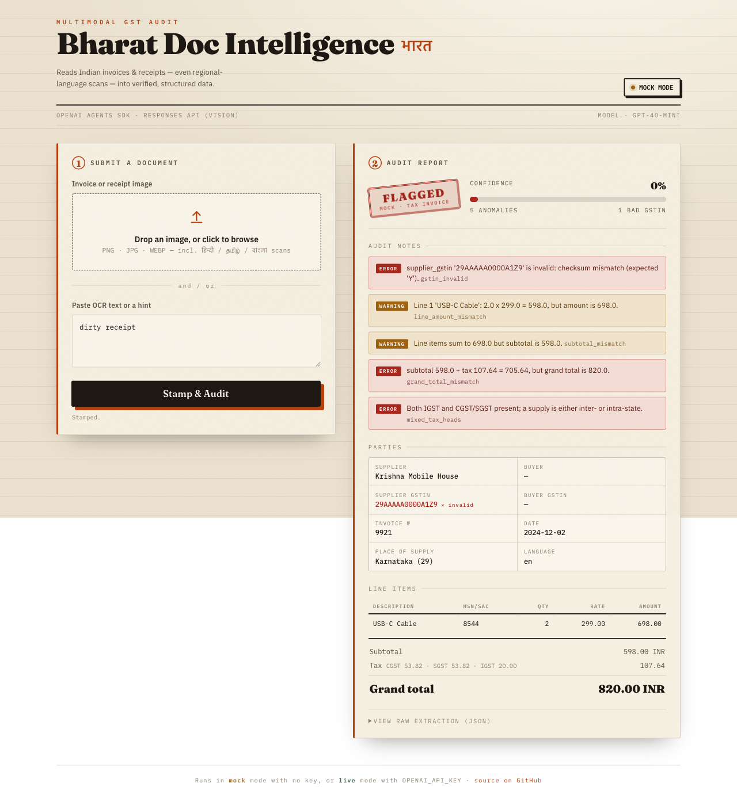

# Bharat Doc Intelligence

**Multimodal GST-document understanding for Indian SMBs — built on the OpenAI Agents SDK + Responses API.**

[Live demo](https://openai-ai-deployment-portfolio.onrender.com) · [Architecture](docs/architecture.md) · [Tutorial](docs/TUTORIAL.md)

[](https://github.com/sciencenerd-des/openai-ai-deployment-portfolio/actions/workflows/ci.yml)


Upload a photo of an Indian GST invoice or receipt — including ones printed in
regional languages — and get back **structured, validated data** with the dodgy
bits flagged: invalid GSTINs, line-item maths that doesn't add up, CGST/SGST
that isn't symmetric, IGST mixed with CGST/SGST, and more.

The app also includes mock-first GST workflow features from the market research
roadmap: **GSTR-2B ↔ purchase-register reconciliation**, GSTIN status checks,
offline IRN recomputation, IMS actions, per-invoice ITC verdicts
(`claim`, `defer`, `block`), vendor follow-up drafts, notice triage, pre-file
GSTR-1 vs 3B checks, and batch analysis without GSTN credentials.

> **Design in one line:** the model *reads* the document into a typed schema;
> deterministic Python *judges* its correctness. You never trust an LLM with
> arithmetic you actually need to be right.

```
┌── photo / OCR text ──┐   ┌─ OpenAI Agents SDK ─┐   ┌──── pure-Python audit ────┐
│  GST invoice image   │ → │ vision + output_type │ → │ GSTIN checksum, line maths │ → report + confidence
│  (en / hi / ta / …)  │   │ + validate_gstin tool│   │ CGST=SGST, totals reconcile│
└──────────────────────┘   └──────────────────────┘   └────────────────────────────┘
```

See [`docs/architecture.md`](docs/architecture.md) for the full diagram and rationale.

| Clean document → **Validated** | Tampered document → **Flagged** |
|---|---|
|  |  |

The interface is styled as a quiet professional review console: the model
extracts structure, and deterministic validation makes the final audit call. The
bad GSTIN and broken totals on the right are caught by the deterministic audit
layer, not the model.

## Quickstart (zero API key, ~30 seconds)

The app ships with a deterministic **mock mode**, so the whole pipeline, UI,
tests, and evals run with no key and no network.

```bash
pip install -r requirements-dev.txt
make test        # 13 tests, all offline
make eval        # anomaly-detection eval: 100% exact-match on the curated set
make run         # open http://localhost:8000  (type "dirty" in the box to see flags)
```

## Live mode (real model)

```bash
cp .env.example .env      # add your OPENAI_API_KEY
pip install -r requirements.txt
make run
```

In live mode the agent reads an uploaded image with `gpt-4o-mini` (vision),
constrained to the `ExtractedInvoice` schema, and may call the `validate_gstin`
function tool to self-check GST numbers. One-click deploy via [`render.yaml`](render.yaml)
or the included [`Dockerfile`](Dockerfile).

## What it checks (the "audit brain")

| Check | Severity | Example |
|-------|----------|---------|
| GSTIN format + modulo-36 checksum | error | `29AAAAA0000A1Z9` → checksum mismatch |
| Tax invoice missing supplier GSTIN | error | — |
| `quantity × unit_price ≠ line amount` | warning | `2 × 299 = 598`, printed `698` |
| Line items don't sum to subtotal | warning | — |
| `subtotal + tax ≠ grand total` | error | — |
| IGST mixed with CGST/SGST | error | a supply is inter- *or* intra-state |
| CGST ≠ SGST | warning | the two halves must be equal |

## Reconciliation sample

The research-backed compliance features run fully offline in mock mode:

- `GET /api/reconcile/sample` returns a labelled sample period with matched,
  missing, rounding mismatch, material mismatch, and blocked-credit cases.
- `POST /api/reconcile` accepts structured `period`, `purchase_register`, and
  `gstr2b` JSON and returns a `ReconReport`.
- `POST /api/followups` drafts approval-gated supplier emails for invoices
  present in the purchase register but missing from GSTR-2B.
- `POST /api/notices/triage` classifies GST notices and drafts a human-reviewed
  reply.
- `POST /api/prefile-check` compares GSTR-1 and GSTR-3B values before filing.
- `POST /api/analyze/batch` runs the existing extraction/audit pipeline over up
  to 25 text snippets; `POST /api/analyze/batch-files` handles up to 10 uploads.
- The UI exposes the sample as ITC and workflow panels with raw JSON for review.

## Eval results

Anomaly detection is scored as a labelled multi-label task; CI fails if
exact-match accuracy regresses. Latest run ([`evals/results/latest.md`](evals/results/latest.md)):

- cases: **7** · exact-match: **100%** · precision **1.00** · recall **1.00** · F1 **1.00**

```bash
python -m evals.run_evals
```

## Project structure

```
app/
  main.py        FastAPI: /, /api/health, /api/analyze
  pipeline.py    extract → validate → score (keeps SDK imports lazy)
  agent.py       OpenAI Agents SDK: vision input, output_type, function tool
  schemas.py     Pydantic models (ExtractedInvoice, Anomaly, AnalysisReport)
  validators.py  GSTIN checksum + arithmetic/anomaly checks (pure, tested)
  mock.py        deterministic fixtures for offline mode
web/index.html   single-page UI (plain HTML/CSS/JS, no build step)
evals/           labelled dataset + scoring harness (CI regression gate)
tests/           pytest, runs fully offline
docs/            architecture + a build-it-yourself tutorial
```

## Tech stack

OpenAI **Agents SDK** · **Responses API** (multimodal/vision) · FastAPI · Pydantic v2 · pytest · GitHub Actions · Docker.

## Roadmap

- [x] Distinctive "auditor's ledger" UI + screenshots in this README.
- [x] Mock-first GSTR-2B ↔ purchase-register reconciliation with IMS actions.
- [x] ITC claim/defer/block scoring and ITC-at-risk totals.
- [x] GSTIN status and offline IRN verification scaffolding at intake.
- [x] Approval-gated supplier follow-up drafts for missing 2B invoices.
- [x] Notice triage and pre-file mismatch checks as deterministic workflow demos.
- [x] Batch ingestion endpoint and regional-language mock fixtures.
- [ ] Live GSP/GSTN adapter behind the existing mock-first interfaces.
- [ ] Stream partial extraction to the UI via Agents SDK streaming events.
- [ ] Expand the eval set with real regional-language document scans.

## Tutorial

A full walkthrough of how this is built — and how to build your own structured
multimodal agent — is in [`docs/TUTORIAL.md`](docs/TUTORIAL.md).

## Product research

Market analysis of the Indian GST/taxation space — pain points, competitive
feature landscape, primary GSTN/NIC API reference, detailed feature specs, and a
scoped reconciliation backlog — is in [`docs/market-research.md`](docs/market-research.md).
It's what drives the roadmap above.

## License

MIT — see [LICENSE](LICENSE).

---

## Why this repo exists

This project is designed as a production-style OpenAI API sample for Indian document workflows.

It demonstrates:

- multimodal document extraction with OpenAI vision-capable models
- structured JSON outputs
- deterministic validation after model generation
- mock-first local development without API keys
- eval-driven regression testing
- developer-friendly FastAPI deployment
- domain-specific error handling for Indian GST documents

## Developer documentation

- [Architecture](docs/architecture.md)
- [OpenAI integration](docs/openai-integration.md)
- [Tutorial](docs/TUTORIAL.md)
- [Eval report](docs/eval-report.md)
- [API reference](docs/api-reference.md)
- [Troubleshooting](docs/troubleshooting.md)
- [Roadmap](ROADMAP.md)

## Developer experience features

- `USE_MOCK=1` mode for zero-key local setup
- `.env.example` with all required variables
- CI that runs tests and evals without secrets
- sample invoice OCR fixture
- deterministic GST validation layer
- FastAPI interactive docs at `/docs`
- Dockerfile and Render deployment config

## 5-minute quickstart

```bash
git clone https://github.com/sciencenerd-des/openai-ai-deployment-portfolio.git
cd openai-ai-deployment-portfolio
python -m venv .venv
source .venv/bin/activate
pip install -r requirements-dev.txt
cp .env.example .env
export USE_MOCK=1
uvicorn app.main:app --reload
```

Then open:

- App: http://localhost:8000
- API docs: http://localhost:8000/docs

## Running with OpenAI

```bash
export USE_MOCK=0
export OPENAI_API_KEY="..."
uvicorn app.main:app --reload
```

The app uses OpenAI for multimodal document understanding, then passes extracted data through deterministic GST validation and reconciliation checks.

## Known limitations

- This is a developer sample and workflow prototype, not tax or legal advice.
- Accuracy depends on document quality, layout, language, and image resolution.
- Mock mode uses deterministic fixtures and does not measure live-model accuracy.
- The eval suite is intentionally small and should be expanded before production use.
- Human review is recommended before filing or making financial decisions.

