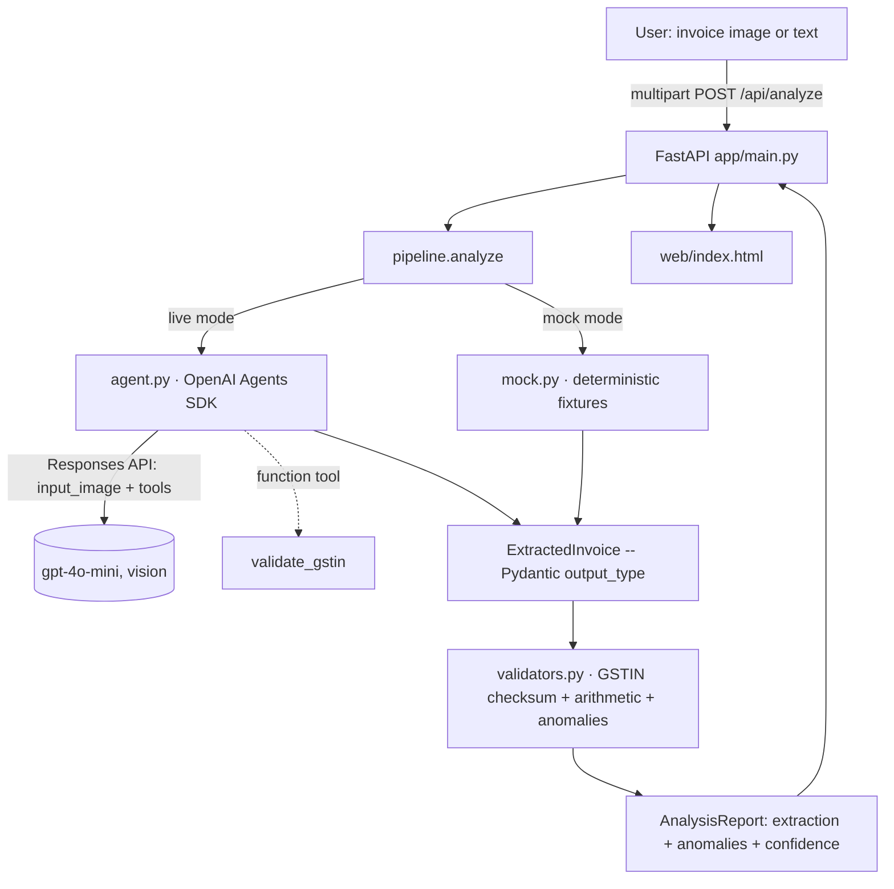

# Architecture

Bharat Doc Intelligence is a thin, well-separated pipeline. The model does what
models are good at (reading messy multilingual documents into structure); pure
Python does what code is good at (deterministic financial/tax validation).

## Design decisions

- **Model for perception, code for judgement.** The LLM only transcribes the
  document into the `ExtractedInvoice` schema. Every correctness claim (GSTIN
  validity, arithmetic, CGST/SGST symmetry) is computed deterministically in
  `validators.py`, so it is testable, free, and auditable.
- **`output_type` over prompt-parsing.** The Agents SDK constrains the model to
  a Pydantic schema, eliminating brittle JSON post-processing.
- **A function tool the model can call.** `validate_gstin` lets the agent
  self-check GST numbers mid-extraction — a small but real demonstration of
  tool use.
- **Mock mode is first-class.** With no API key the entire pipeline, UI, tests,
  and evals run deterministically. This is what makes the repo runnable by a
  reviewer in one command and gives CI a free regression gate.
- **Evals gate the logic.** `evals/run_evals.py` scores anomaly detection as a
  multi-label problem and fails CI if exact-match accuracy regresses.
